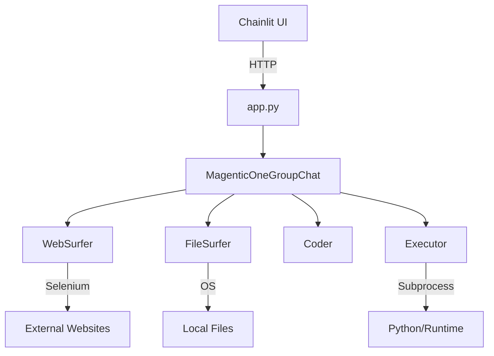

# AgenticFleet

A powerful multi-agent system for adaptive AI reasoning and automation. AgenticFleet combines Chainlit's interactive interface with AutoGen's multi-agent capabilities to create a flexible, powerful AI assistant platform.

<div align="center">
  <p>
    
    
    
    
    <a href="https://discord.gg/ebgy7gtZHK">
      
    </a>
    <a href="https://x.com/agenticfleet">
      
    </a>
  </p>
</div>

<div align="center">
  <video src="https://github.com/user-attachments/assets/b1ad83ce-b8af-4406-99ed-257a07c0c7cf" autoplay loop muted playsinline width="800">
    <p>Your browser doesn't support HTML5 video. Here is a <a href="assets/b1ad83ce-b8af-4406-99ed-257a07c0c7cf">link to the video</a> instead.</p>
  </video>
</div>

## Table of Contents

1. [Introduction](#introduction)
2. [System Architecture](#system-architecture)
3. [Quick Start](#quick-start)
   - [Installation & Environment Setup](#installation--environment-setup)
   - [Running AgenticFleet](#running-agenticfleet)
   - [Using Docker](#using-docker)
4. [Installation Guide](#installation-guide)
   - [Prerequisites](#prerequisites)
   - [Installation Steps](#installation-steps)
   - [Troubleshooting Installation](#troubleshooting-installation)
   - [Optional Feature Sets](#optional-feature-sets)
   - [Warning About Editable Installations](#warning-about-editable-installations)
5. [Model Provider Installation](#model-provider-installation)
6. [Supported Model Providers](#supported-model-providers)
7. [Key Features](#key-features)
8. [Configuration](#configuration)
9. [Error Handling](#error-handling)
10. [Community Contributions](#community-contributions)
11. [Star History](#star-history)
12. [API Overview](#api-overview)
13. [Advanced Configuration](#advanced-configuration)
14. [Supported Features](#supported-features)
15. [Performance Optimization](#performance-optimization)
16. [Contributing](#contributing)
17. [License](#license)

## Introduction

AgenticFleet operates through a coordinated team of specialized agents that work together to provide advanced AI capabilities. This project leverages Chainlit's interactive interface with AutoGen's multi-agent system to deliver robust and adaptive solutions.

## System Architecture



- **WebSurfer**: Navigates the web, extracts data, and processes screenshots.
- **FileSurfer**: Manages file operations and extracts information from local files.
- **Coder**: Generates and reviews code, ensuring quality and efficiency.
- **Executor**: Executes code safely in an isolated environment and provides feedback.

## Quick Start (fastest way)
1. Install dependencies:

```bash
pip install agentic-fleet
```

2. Set up environment variables:

```bash
export OPENAI_API_KEY=your_api_key
export AZURE_OPENAI_KEY=your_azure_key
```

3. Start AgenticFleet using one of these methods:

```bash
# Using CLI command (recommended)
agenticfleet start

# Using CLI command without OAuth
agenticfleet start no-oauth
```

### Alternative Start Methods

You can also use the provided scripts in the `scripts` directory:

```bash
# Using shell script
./scripts/run.sh

# Using Python script
./scripts/run_direct.py

# Using direct server start
./scripts/start_server.sh
```

### Installation & Environment Setup

Before starting AgenticFleet, install the package using the `uv` package manager:

```bash
uv pip install agentic-fleet
uv pip install playwright
playwright install --with-deps chromium
```

Then, set up your environment:

1. **Copy the Example File**

   ```bash
   cp .env.example .env
   ```

2. **Configure Environment Variables**

   Open the `.env` file and set the required values. At a minimum, configure your Azure OpenAI settings:

   ```env
   # Required: Azure OpenAI Configuration
   AZURE_OPENAI_API_KEY=your_api_key
   AZURE_OPENAI_ENDPOINT=your_endpoint
   AZURE_OPENAI_DEPLOYMENT=your_deployment
   AZURE_OPENAI_MODEL=your_model
   ```

### Running AgenticFleet

There are several ways to run AgenticFleet:

1. **Using CLI Commands** (Recommended):
   ```bash
   # Start with default configuration (OAuth enabled)
   agenticfleet start

   # Start without OAuth
   agenticfleet start no-oauth

   # Start with custom host and port
   agenticfleet start --host localhost --port 8000
   ```

2. **Using Shell Script**:
   ```bash
   # Start the application using the shell script
   ./scripts/run.sh
   ```

3. **Using Python Script**:
   ```bash
   # Start the application using Python
   python scripts/run_direct.py
   ```

### Using Docker

If you prefer using Docker, follow these instructions:

```bash
# Pull the latest image
docker pull qredence/agenticfleet:latest

# Run with minimum configuration (replace placeholders with your actual values)
docker run -d -p 8001:8001 \
  -e AZURE_OPENAI_API_KEY=your_key \
  -e AZURE_OPENAI_ENDPOINT=your_endpoint \
  -e AZURE_OPENAI_DEPLOYMENT=your_deployment \
  -e AZURE_OPENAI_MODEL=your_model \
  qredence/agenticfleet:latest

# Alternatively, run with additional configuration including OAuth
docker run -d -p 8001:8001 \
  -e AZURE_OPENAI_API_KEY=your_key \
  -e AZURE_OPENAI_ENDPOINT=your_endpoint \
  -e AZURE_OPENAI_DEPLOYMENT=your_deployment \
  -e AZURE_OPENAI_MODEL=your_model \
  -e USE_OAUTH=true \
  -e OAUTH_GITHUB_CLIENT_ID=your_client_id \
  -e OAUTH_GITHUB_CLIENT_SECRET=your_client_secret \
  qredence/agenticfleet:latest

# To run without OAuth:
docker run -d -p 8001:8001 \
  -e AZURE_OPENAI_API_KEY=your_key \
  -e AZURE_OPENAI_ENDPOINT=your_endpoint \
  -e USE_OAUTH=false \
  qredence/agenticfleet:latest
```

## Installation Guide

### Prerequisites

- **Python Version:** 3.10-3.12
- **Operating Systems:** macOS, Linux, Windows

### Installation Steps

1. **Install `uv` Package Manager**

   `uv` is a fast and efficient package manager. Choose your preferred installation method:

   #### macOS/Linux

   ```bash
   # Using pip
   pip install uv

   # Using Homebrew (macOS)
   brew install uv

   # Using curl
   curl -LsSf https://astral.sh/uv/install.sh | sh
   ```

   #### Windows

   ```powershell
   # Using pip
   pip install uv

   # Using winget
   winget install uv
   ```

2. **Create and Activate a Virtual Environment**

   ```bash
   # Create a new virtual environment
   uv venv

   # Activate the virtual environment
   # On macOS/Linux
   source .venv/bin/activate

   # On Windows
   .venv\Scripts\activate
   ```

3. **Install AgenticFleet**

   ```bash
   # Install the latest stable version
   uv pip install agentic-fleet

   # Install Playwright for web automation and scraping (needed by WebSurfer)
   uv pip install playwright
   playwright install --with-deps chromium
   ```

   **Playwright Installation Notes:**

   - Installs the Chromium browser for web automation.
   - Includes necessary browser dependencies.
   - Required for web scraping and browser-based agents.
   - Supports both headless and headed modes.

4. **Verify Installation**

   ```bash
   # Check installed version
   uv pip show agentic-fleet

   # Run a quick version check
   python -c "import agentic_fleet; print(agentic_fleet.__version__)"
   ```

### Troubleshooting Installation

- Ensure you're using Python 3.10-3.12.
- Update `uv` to the latest version: `pip install -U uv`.
- If issues arise, consult our [GitHub Issues](https://github.com/Qredence/AgenticFleet/issues).

### Optional Feature Sets

```bash
# Install with optional telemetry features
uv pip install 'agentic-fleet[telemetry]'

# Install with optional tracing features
uv pip install 'agentic-fleet[tracing]'
```

### Warning About Editable Installations

**DO NOT use `-e` unless you are a core contributor.**  
Editable installations are not supported in production, may introduce unexpected behaviors, and void package support. They are intended solely for package development. If you make local modifications, please file a GitHub issue and submit a pull request.

## Model Provider Installation

Please refer to the existing documentation or the [docs/installation.md](docs/installation.md) file for details on installing model providers.

## Supported Model Providers

AgenticFleet supports multiple LLM providers including OpenAI, Azure OpenAI, Google Gemini, DeepSeek, Ollama, Azure AI Foundry, and CogCache. For specifics on configuration and usage, please refer to the detailed sections in the documentation.

## Key Features

- Advanced multi-agent coordination
- Support for several LLM providers
- GitHub OAuth authentication (optional)
- Configurable agent behaviors and execution isolation
- Comprehensive error handling and automated recovery
- Multi-modal content processing (text, images, etc.)

## Configuration

For complete configuration details, review the `.env.example` file and the [docs/usage-guide.md](docs/usage-guide.md) for further instructions.

## Error Handling

AgenticFleet includes robust error handling:

- Graceful degradation on failures
- Detailed error logging and reporting
- Automatic cleanup and session recovery
- Execution timeout management

## Community Contributions

AgenticFleet welcomes contributions from the community. Please review our [CONTRIBUTING.md](CONTRIBUTING.md) and [CODE_OF_CONDUCT.md](CODE_OF_CONDUCT.md) for guidelines on submitting issues and pull requests.

## Star History

[](https://star-history.com/#Qredence/AgenticFleet&Date)


#### Configuring a Team

```python
from agentic_fleet.backend.agents.orchestrator_agent import create_team

team = create_team([
    PlannerAgent(name="Strategic Planner"),
    CodeCrafterAgent(name="Code Developer"),
    ValidatorAgent(name="Quality Assurer")
])
```


## Advanced Configuration

### Agent Configuration

Agents can be configured using YAML files located in `src/agentic_fleet/config/`:

```yaml
# Example agent configuration
agent_type: AssistantAgent
name: AI Assistant
model: gpt-4
temperature: 0.7
max_context_length: 4096
```

### Environment Setup

1. Install dependencies:

```bash
pip install agentic-fleet
```

2. Set up environment variables:

```bash
export OPENAI_API_KEY=your_api_key
export AZURE_OPENAI_KEY=your_azure_key
```

3. Start AgenticFleet:

```bash
agenticfleet start
```

## Supported Features

- Multi-agent task allocation
- Dynamic team composition
- Advanced error handling
- Streaming AI interactions
- Extensible agent framework

## Performance Optimization

- Use streaming APIs for real-time interactions
- Configure model temperature between 0.7-1.0 for creative tasks
- Implement efficient agent communication protocols

## Contributing

We welcome contributions! Please read our [API.md](API.md) for detailed guidelines on extending AgenticFleet.

## License

AgenticFleet is open-source software licensed under [INSERT LICENSE]
