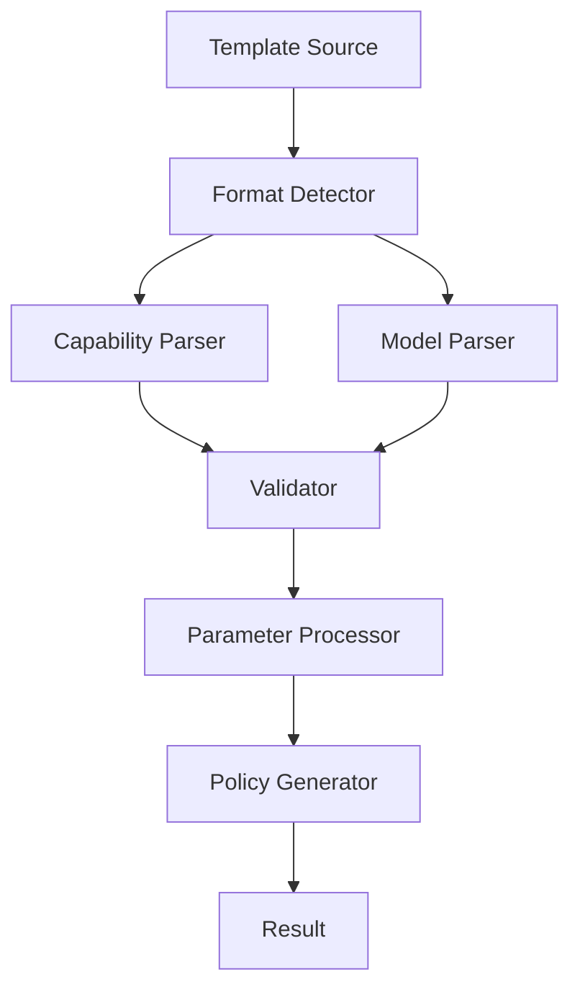

# Template System Architecture

## Overview

ARIA's template system provides a flexible way to create, manage, and apply policy templates. The system supports both capability-based templates (for testing) and model-based templates (for production).

## Design Goals

1. Flexibility
   - Support multiple use cases
   - Easy customization
   - Version control
   - Multiple template formats

2. Maintainability
   - Clear structure
   - Documentation
   - Testing support
   - Format-specific validation

3. Performance
   - Efficient validation
   - Quick application
   - Minimal overhead
   - Optimized parsing

4. Usability
   - Intuitive parameter system
   - Clear error messages
   - Format detection
   - Inheritance support

## Template Formats

### Capability-Based Format
Designed primarily for testing and human readability:
- Focus on specific AI capabilities
- Clear conditions and restrictions
- Simplified structure for non-technical users
- Easier to understand and validate

### Model-Based Format
Designed for production environments:
- Integration with code repositories
- Path-specific rules
- Predefined models with default settings
- More granular control over permissions

## System Components

### Template Engine



### Template Structure

#### Capability-Based Template
```yaml
name: capability_template
version: 1.0.0
description: Template for capability-based policies
type: capability
parameters:
  - name: capability_level
    type: string
    description: Level of capabilities to enable
    default: basic
    options:
      - basic
      - advanced
      - expert
capabilities:
  - name: code_generation
    description: Generate code based on user requirements
    allowed: true
    conditions:
      - Must include appropriate comments.
```

#### Model-Based Template
```yaml
name: model_template
version: 1.0.0
description: Template for model-based policies
type: model
parameters:
  - name: security_level
    type: string
    description: Security level for the policy
    default: standard
    options:
      - minimal
      - standard
      - strict
model: assistant
defaults:
  allow:
    - review
    - suggest
```

## Implementation Details

### Template Detection

```python
def detect_template_format(data: Dict[str, Any]) -> str:
    """Detect template format (capability or model).
    
    Args:
        data: Template data
        
    Returns:
        "capability" or "model"
    """
    if "type" in data:
        return data["type"]
    elif "capabilities" in data:
        return "capability"
    elif "model" in data:
        return "model"
    else:
        # Default to capability-based
        return "capability"
```

### Template Loading

```python
def load_template(path: str) -> Template:
    """Load a template from file.
    
    Args:
        path: Path to template file
        
    Returns:
        Template instance
    """
    with open(path) as f:
        data = yaml.safe_load(f)
    
    template_format = detect_template_format(data)
    if template_format == "capability":
        return CapabilityTemplate(**data)
    else:
        return ModelTemplate(**data)
```

### Parameter Processing

```python
def process_parameters(template: Template, params: Dict[str, Any]) -> Template:
    """Process and apply parameters to a template.
    
    Args:
        template: Template instance
        params: Parameter values
        
    Returns:
        Updated template
    """
    for name, value in params.items():
        template.set_parameter(name, value)
    
    return template
```

### Template Application

```python
def apply_template(template: Template, policy: Policy = None) -> Policy:
    """Apply a template to create or update a policy.
    
    Args:
        template: Template instance
        policy: Optional existing policy to update
        
    Returns:
        New or updated policy
    """
    if policy is None:
        if isinstance(template, CapabilityTemplate):
            policy = CapabilityPolicy(template.name)
        else:
            policy = ModelPolicy(template.name)
    
    # Apply template-specific logic
    template.apply(policy)
    
    return policy
```

## Validation Process

1. Schema validation
   - Required fields
   - Field types
   - Format-specific requirements
2. Parameter validation
   - Required parameters
   - Parameter types
   - Option validation
3. Content validation
   - Capability validation for capability templates
   - Model and path validation for model templates
4. Inheritance validation
   - Parent template exists
   - Compatible formats
   - No circular dependencies

## Best Practices

1. Choose the appropriate template format
   - Capability-based for testing and human-readable policies
   - Model-based for production and integration with code repositories
2. Version templates
3. Document parameters
4. Test thoroughly
5. Keep templates focused
6. Use inheritance for common patterns
7. Validate before distribution

## See Also

- [Templates API](../api/templates.md)
- [Template Guide](../guides/templates.md)
- [Example Templates](../examples/template-usage.yml)
- [Policy Format Examples](../examples/policy-formats.yml)
