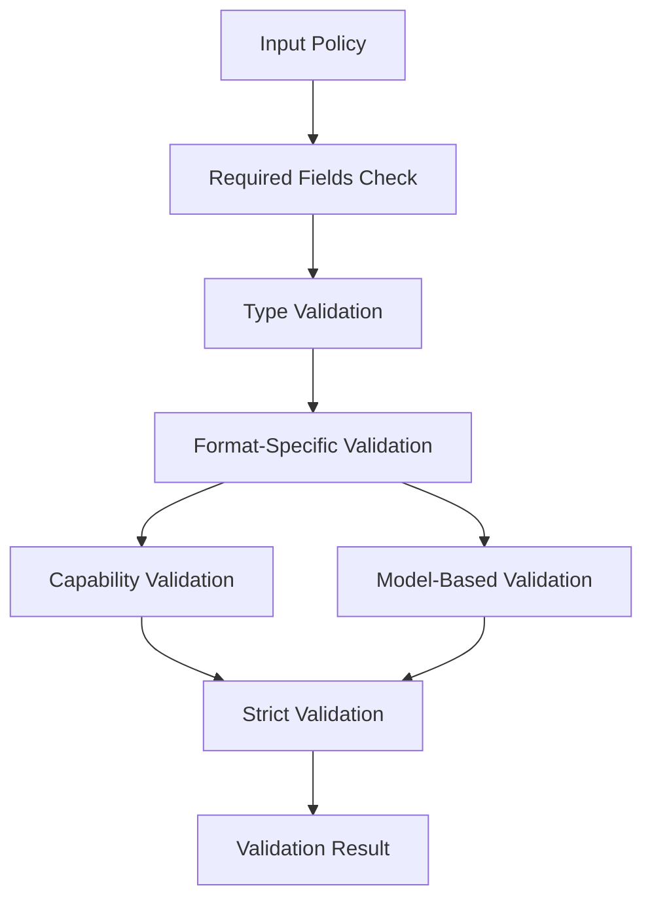

# Validation System Architecture

## Overview

ARIA's validation system ensures the integrity and correctness of policies and templates. The system supports multiple policy formats to accommodate both testing and production use cases.

## Design Goals

1. Reliability
   - Comprehensive checks
   - Clear error messages
   - Consistent results

2. Performance
   - Fast validation
   - Minimal memory usage
   - Efficient algorithms

3. Extensibility
   - Custom validators
   - Plugin support
   - Easy updates

4. Flexibility
   - Support for multiple policy formats
   - Strict and standard validation modes
   - Customizable validation rules

## Policy Formats

ARIA supports two primary policy formats:

### 1. Capability-Based Policies (Testing)

```yaml
version: "1.0.0"
name: "Test Policy"
description: "A comprehensive test policy for validation."
capabilities:
  - name: "test_capability"
    description: "A detailed test capability description."
    allowed: true
    conditions:
      - "Must follow all testing guidelines."
      - "Must document all test cases."
restrictions:
  - "No unauthorized testing."
  - "Must follow security protocols."
```

### 2. Model-Based Policies (Production)

```yaml
version: "1.0.0"
name: "Production Policy"
model: "assistant"
defaults:
  allow:
    - "review"
    - "suggest"
  require:
    - "human_review"
paths:
  "src/**/*.py":
    allow:
      - "analyze"
      - "review"
  "tests/**":
    allow:
      - "generate"
      - "modify"
```

## Validation Pipeline



## Validation Components

### ValidationResult

The `ValidationResult` class stores validation outcomes:

```python
class ValidationResult:
    """Represents a policy validation result."""
    
    def __init__(self) -> None:
        """Initialize validation result."""
        self.valid: bool = True
        self.errors: List[str] = []
        self.warnings: List[str] = []
    
    def add_error(self, message: str) -> None:
        """Add an error message."""
        
    def add_warning(self, message: str) -> None:
        """Add a warning message."""
```

### PolicyValidator

The `PolicyValidator` class performs the actual validation:

```python
class PolicyValidator:
    """Validates AI participation policies."""
    
    def validate_file(self, path: Union[str, Path], strict: bool = False) -> ValidationResult:
        """Validate a policy file."""
        
    def validate_policy(self, policy: Dict[str, Any], strict: bool = False) -> ValidationResult:
        """Validate policy data."""
```

## Validation Rules

### Common Rules (Both Formats)
- Required fields: version, name
- Version must be a string
- Name must be present

### Capability-Based Rules
- Capabilities must be a list
- Each capability must have name, description, and allowed fields
- Conditions must be a list if present
- Restrictions must be a list if present

### Model-Based Rules
- Model must be a valid PolicyModel value
- Actions must be allowed for the specified model
- Requirements must be valid for the specified model
- Path patterns must be valid

### Strict Validation Rules
- Version should follow semantic versioning
- Description should be sufficiently detailed
- Capability descriptions should be sufficiently detailed
- Conditions should end with a period
- Path patterns should not be too broad or too specific

## Best Practices

1. Always validate policies before applying them
2. Use strict validation during development
3. Provide clear error messages to users
4. Handle validation errors and warnings appropriately
5. Test with both policy formats if needed

## See Also

- [Validator API](../api/validator.md)
- [Policy Guide](../guides/inheritance.md)
- [Example Policies](../examples/basic-policy.yml)
