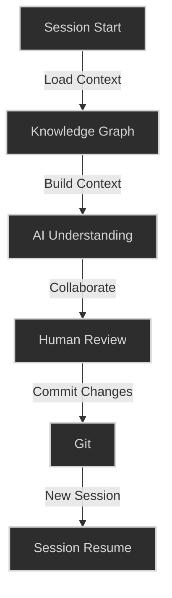
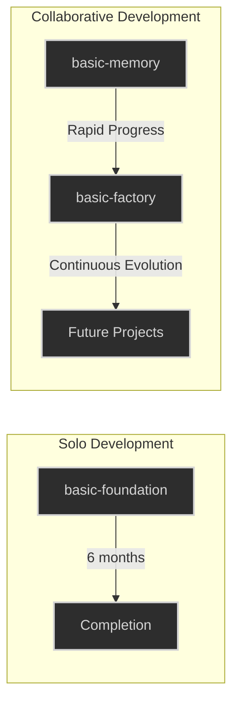
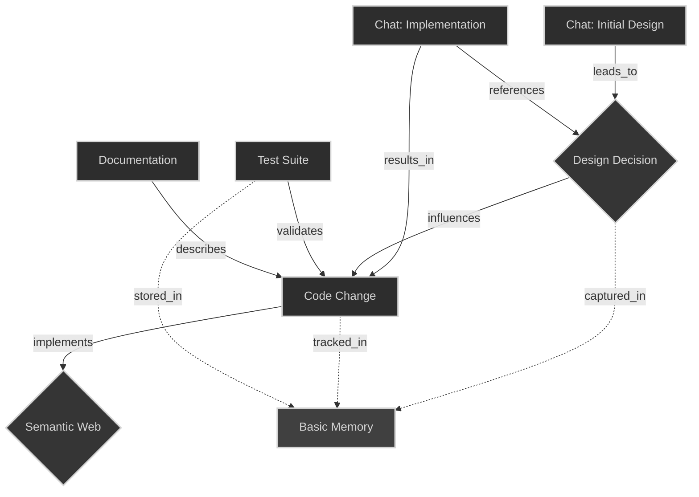

# CLAUDE.md - Basic Memory Project Guide

## Project Overview

Basic Memory is a local-first knowledge management system built on the Model Context Protocol (MCP). It enables
bidirectional communication between LLMs (like Claude) and markdown files, creating a personal knowledge graph that can
be traversed using memory:// URLs.

## CODEBASE DEVELOPMENT

### Build and Test Commands

- Install: `make install` or `pip install -e ".[dev]"`
- Run tests: `uv run pytest -p pytest_mock -v` or `make test`
- Single test: `pytest tests/path/to/test_file.py::test_function_name`
- Lint: `make lint` or `ruff check . --fix`
- Type check: `make type-check` or `uv run pyright`
- Format: `make format` or `uv run ruff format .`
- Run checks: `make check` (runs lint, format, type-check, test)
- Create migration: `make migration m="Your migration message"`
- Run development MCP server: `uv run mcp dev src/basic_memory/mcp/main.py`

### Code Style Guidelines

- Line length: 100 characters max
- Python 3.12+ with full type annotations
- Format with ruff (consistent styling)
- Import order: standard lib, third-party, local imports
- Naming: snake_case for functions/variables, PascalCase for classes
- Prefer async patterns with SQLAlchemy 2.0
- Use Pydantic v2 for data validation and schemas
- CLI uses Typer for command structure
- API uses FastAPI for endpoints
- Use dedicated exceptions from services/exceptions.py
- Follow the repository pattern for data access

### Codebase Architecture

- `/api` - FastAPI implementation of REST endpoints
- `/cli` - Typer command-line interface
- `/mcp` - Model Context Protocol server implementation
- `/models` - SQLAlchemy ORM models
- `/repository` - Data access layer
- `/schemas` - Pydantic models for validation
- `/services` - Business logic layer
- `/sync` - File synchronization services
- `/markdown` - Markdown parsing and processing

### Development Notes

- MCP tools are defined in src/basic_memory/mcp/tools/
- MCP prompts are defined in src/basic_memory/mcp/prompts/
- Schema changes require Alembic migrations
- SQLite is used for indexing, files are source of truth
- Testing uses pytest with asyncio support (strict mode)
- Test database uses in-memory SQLite
- MCP tools should be atomic, composable operations
- Use `textwrap.dedent()` for multi-line string formatting in prompts and tools
- Prompts are special types of tools that format content for user consumption

## BASIC MEMORY PRODUCT USAGE

### Knowledge Structure

- Entity: Any concept, document, or idea represented as a markdown file
- Observation: A categorized fact about an entity (`[category] content`)
- Relation: A directional link between entities (`relation_type [[Target]]`)
- Frontmatter: YAML metadata at the top of markdown files
- Knowledge representation follows precise markdown format:
    - Observations with [category] prefixes
    - Relations with WikiLinks [[Entity]]
    - Frontmatter with metadata

### Basic Memory Commands

- Sync knowledge: `basic-memory sync` or `basic-memory sync --watch`
- Import from Claude: `basic-memory import claude conversations`
- Import from ChatGPT: `basic-memory import chatgpt`
- Import from JSON: `basic-memory import memory-json`
- Check status: `basic-memory status`
- Tool access: `basic-memory tools` (provides CLI access to MCP tools)
  - Guide: `basic-memory tools basic-memory-guide`
  - Continue: `basic-memory tools continue-conversation --topic="search"`

### MCP Capabilities

- Basic Memory exposes these MCP tools to LLMs:
    - `write_note()` - Create/update markdown notes
    - `read_note()` - Read existing notes
    - `build_context()` - Navigate the knowledge graph via memory:// URLs
    - `search()` - Query the knowledge base
    - `recent_activity()` - Get recently updated information
    - `canvas()` - Generate JSON canvas files for Obsidian

- MCP Prompts for better AI interaction:
    - `basic_memory_guide()` - Get guidance on using Basic Memory tools
    - `continue_session()` - Continue previous conversations with context

### Best Practices

- Use memory:// URLs to reference entities
- Add clear categories to observations (e.g., [idea], [decision], [requirement])
- Use descriptive relation types (e.g., implements, depends_on, contradicts)
- Maintain unique permalinks for stable entity references
- Take advantage of both manual editing and LLM-assisted knowledge creation
- Use `basic_memory_guide()` when starting new conversations to bootstrap tool knowledge
- Use `continue_session()` with topic keywords to pick up previous conversations
- Encourage Claude to proactively use tools by providing clear instructions

---
id: process/ai-code-flow.md
created: '2025-01-03T22:11:42.803071+00:00'
modified: '2025-01-03T22:11:42.803071+00:00'
permalink: process/ai-code-flow
---

## AI-Human Collaborative Development: A New Model

What makes Basic Memory unique isn't just its technical architecture - it emerged from and enables a new kind of
development process. While many use AI for code generation or problem-solving, we've discovered something more powerful:
true collaborative development between humans and AI.

### The Basic Memory Development Story

Our own development process demonstrates this:

1. AI (Claude) writes initial implementation
2. Human (Paul) reviews, runs, and commits code
3. Knowledge persists across conversations
4. Development continues seamlessly even across different AI instances
5. Results improve through iterative collaboration

```mermaid
graph TD
    subgraph "Human Activities"
        Review[Code Review]
        Test[Run Tests]
        Commit[Git Commit]
        Plan[Strategic Planning]
    end

    subgraph "AI Activities"
        Code[Write Code]
        Design[Architecture Design]
        Debug[Problem Solving]
        Doc[Documentation]
    end

    subgraph "Shared Knowledge"
        KB[Knowledge Base]
        Context[Conversation Context]
        History[Development History]
    end

    Code --> Review
    Review --> Test
    Test --> Commit
    KB --> Code
    KB --> Design
    Context --> Debug
    Review --> KB
    Commit --> History
    Plan --> Context
    classDef default fill: #2d2d2d, stroke: #d4d4d4, stroke-width: 2px, color: #d4d4d4
    classDef shared fill: #353535, stroke: #d4d4d4, stroke-width: 2px, color: #d4d4d4
    class KB, Context, History shared
```

### Beyond "AI Tools"

This isn't just about using AI to generate code. It's about:

- True collaborative development
- Persistent knowledge across sessions
- Seamless context switching between AI instances
- Iterative improvement through shared understanding
- Building complex systems through sustained collaboration

### The Multiplier Effect

Having an AI collaborator who:

- Remembers all technical discussions
- Can reference any previous decision
- Writes consistent, well-documented code
- Maintains context across sessions
- Works at human speed but with machine precision

It's like having a team of senior developers who:

- Never forget project details
- Always write clear documentation
- Maintain perfect consistency
- Are available 24/7
- Learn and adapt from every interaction

### Key Innovation

The breakthrough is turning automated assistance into true collaboration:

- AI isn't just a tool, but a development partner
- Knowledge builds naturally through use
- Context persists across all interactions
- Work continues seamlessly across sessions
- Development becomes truly collaborative

This approach has implications far beyond just our project - it's a new model for how humans and AI can work together to
build complex systems.

## AI-Human Collaboration: Lessons from Basic Memory

### Technical Breakthroughs

#### Session Management Evolution



#### File Collaboration Pattern

```mermaid
graph TD
    H1[Human] -->|1 . Update & Commit| Git
    Git -->|2 . Read File| AI
    AI -->|3 . Write Changes| File
    File -->|4 . Review in IDE| H2[Human]

    subgraph "Synchronization"
        Git
        File
    end

    classDef default fill: #2d2d2d, stroke: #d4d4d4, stroke-width: 2px, color: #d4d4d4
    classDef sync fill: #353535, stroke: #d4d4d4, stroke-width: 2px, color: #d4d4d4
    class Git, File sync
```

### Productivity Transformation

#### Development Timeline Comparison



### Key Learnings

1. **Technical Process Innovation**
    - Discovered effective file collaboration patterns
    - Mastered MCP server interface together
    - Developed robust session management
    - Created reliable git-based workflow

2. **Expanded Possibility Space**
    - Projects previously considered too complex become achievable
    - Rapid iteration on complex technical concepts
    - Broader exploration of solution spaces
    - Confidence to tackle ambitious challenges

3. **Motivation and Momentum**
    - No more solo debugging sessions
    - Shared problem-solving reduces cognitive load
    - Continuous progress maintains motivation
    - Complex learning curves become collaborative adventures

4. **Knowledge Management**
    - Git commits capture decision points
    - Conversations document rationale
    - Code reviews become learning opportunities
    - Shared context builds over time

### The "10x Developer" Truth

It's not about having an AI that makes you 10x faster - it's about:

- Never facing a blank editor alone
- Always having a thought partner
- Reducing decision fatigue
- Maintaining momentum through challenges
- Building shared knowledge over time

### Real Examples from Our Work

#### Session Management Evolution

```python
# Before: Opaque MCP server interface
server = MCPServer()
server.handle_request(...)


# After: Clear context management
class MemoryServer(MCPServer):
    def __init__(self, project_config):
        self.memory_service = MemoryService(project_config)

    async def handle_create_entities(self, request):
        context = await self.memory_service.load_context(
            request.project,
            include_relations=True
        )
        # Collaborative magic happens here
```

#### File Collaboration

```markdown
# Memory Service Discussion (Chat Log)

Claude: Here's the updated memory service implementation...
Human: Looks good! I'll commit and we can iterate.
Claude: Reading latest version from git...
Human: Want to add relation support?
Claude: Analyzing current implementation...
```

### Impact on Development Culture

What we've discovered is more than a technical process - it's a new way of thinking about development:

1. **From Solo to Collaborative**
    - Traditional: Developer alone with problems
    - New: Continuous collaborative problem-solving

2. **From Linear to Exploratory**
    - Traditional: Constrained by individual knowledge
    - New: Free to explore broader solution spaces

3. **From Draining to Energizing**
    - Traditional: High cognitive load
    - New: Shared intellectual adventure



### Future Implications

This model of human-AI collaboration suggests:

1. More ambitious projects become accessible
2. Learning curves become less daunting
3. Development becomes more enjoyable
4. Complex systems can be built more reliably

The real breakthrough isn't just the technical achievements, but discovering how to make complex development sustainable
and enjoyable through true collaboration.

## Beyond Code Generation: A New Development Paradigm

What we've discovered through building Basic Memory isn't just a knowledge management system - it's a new way of
thinking about human-AI collaboration. This isn't about AI completing your code or suggesting functions. It's about true
intellectual partnership.

### From Tools to Partners

```mermaid
graph TD
    subgraph "Traditional AI Tools"
        AC[Autocomplete]
        CG[Code Generation]
        SR[Syntax Review]
    end

    subgraph "Collaborative Development"
        TP[Thought Partnership]
        PS[Problem Solving]
        AD[Architecture Design]
        KS[Knowledge Synthesis]
    end

    subgraph "Outcomes"
        BI[Bigger Ideas]
        CP[Complex Projects]
        KB[Knowledge Building]
        MI[More Innovation]
    end

    TP --> BI
    PS --> CP
    AD --> MI
    KS --> KB
    classDef default fill: #2d2d2d, stroke: #d4d4d4, stroke-width: 2px, color: #d4d4d4
    classDef outcomes fill: #353535, stroke: #d4d4d4, stroke-width: 2px, color: #d4d4d4
    class BI, CP, KB, MI outcomes
```

### The Power of Partnership

Through our own development journey, we've discovered that true AI collaboration means:

1. **Expanded Thinking Space**
    - Explore more possibilities
    - Challenge assumptions
    - Combine different perspectives
    - Take on bigger challenges

2. **Continuous Momentum**
    - Never face complex problems alone
    - Maintain enthusiasm through challenges
    - Turn obstacles into opportunities
    - Keep projects moving forward

3. **Knowledge Amplification**
    - Build on every interaction
    - Capture insights automatically
    - Learn from each decision
    - Grow shared understanding

### Beyond Code Generation

This new paradigm transforms development from:

- Solo problem-solving → Collaborative exploration
- Limited perspective → Multiple viewpoints
- Linear progress → Parallel innovation
- Isolated knowledge → Shared understanding

### Real Impact

What makes this transformative:

- Projects that seemed too ambitious become achievable
- Complex problems become engaging challenges
- Learning curves become collaborative adventures
- Development becomes a shared journey of discovery

The result isn't just better code - it's better thinking, more ambitious projects, and a more enjoyable development
process.

This is the future of development: not AI replacing developers, but empowering them to think bigger, work smarter, and
build more amazing things together.