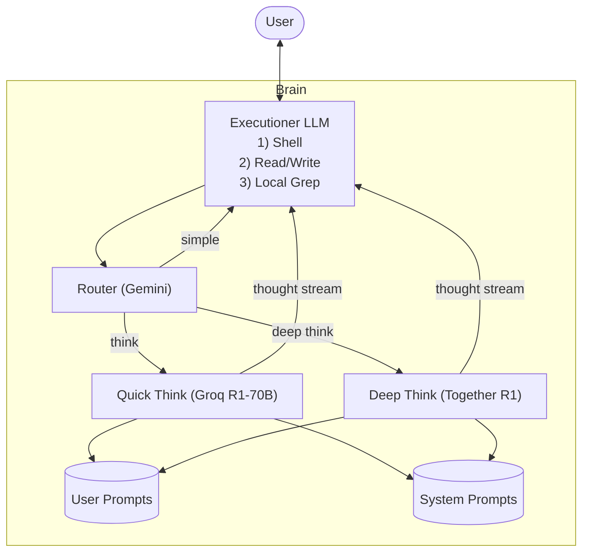

# AI Kit

AI Kit is designed for your IDE's agent.

Built to integrate with text editors like Cursor or Windsurf (or any environment with a shell), it extends your agent with search, reasoning, and memory.

## Getting Started 🚀

Since AI Kit leverages the most cutting edge models at any given time, you'll need some API keys. Fortunately, the cost of running these models is very low.

Required API Keys:
- `GROQ_API_KEY` - For lightning-fast thinking with `r1-70B` ([get it here](https://console.groq.com/keys))
- `TOGETHER_API_KEY` - For deep thinking and reasoning with `r1-670B` ([sign up](https://api.together.xyz/settings/api-keys))
- `GEMINI_API_KEY` - For smart routing ([grab one](https://makersuite.google.com/app/apikey))

Optional API Keys:
- `COHERE_API_KEY` - For reranking search results ([get access](https://dashboard.cohere.com/api-keys))

Drop these in your `.env` file at your project root.

### Quick Setup

```bash
# 1. Initialize AI Kit (creates necessary dirs and system prompts)
ai-kit init

# 2. Add your API keys to .env
GROQ_API_KEY=your_key_here
TOGETHER_API_KEY=your_key_here
GEMINI_API_KEY=your_key_here
COHERE_API_KEY=your_key_here  # Optional

# 3. Verify everything's working
ai-kit help
```

That's it! Run `ai-kit help` anytime to check your setup status, or `ai-kit status` to view API keys.

## The "Brain" 🧠



The thinking system (brain) has three main components:

1. **The IDE Agent** - This is the built in agent in your IDE. I'd recommend using Cursor + Claude.
2. **The Router** - Uses Gemini to route queries to the appropriate reasoning LLM.
3. **The Thinking LLM** - Injects thinking tokens from R1 into the agent's context.

## Tools

The agent has access to a few extra tools:

- `search` - Search the web for information
- `fetch` - Fetch a URL and return the content
- `crawl` (beta) - Crawl a website and save the content

## Principles 🎯

- Local first, for full control
- Hardcode as little as possible, instead use composable patterns and leverage agency
- Runtime first, prepare as little as possible, give the agent tools instead
- Use a non-reasoning model (like Claude-3.5-sonnet) for tool calls and edits and rely on reasoning models for planning and orchestration