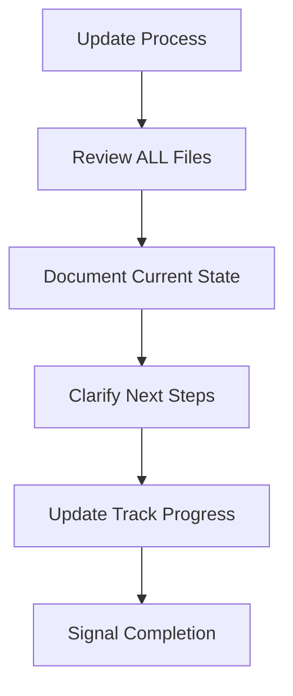

# Memory Updates

Memory Bank updates occur when:

1. Discovering new project patterns
2. After implementing significant changes
3. When user requests with **$mem update**
4. When switching between tracks

## Update Process

When updating memory:

1. **Review ALL relevant files**
   - Check for outdated information
   - Identify missing context
   - Ensure consistency across files

2. **Document current state**
   - Update active-context.md with current focus
   - Record completed work in progress.md
   - Update track-specific files

3. **Clarify next steps**
   - Document planned next actions
   - Note any blockers or dependencies
   - Prioritize upcoming work

4. **Update track progress**
   - Update track-specific progress files
   - Note track dependencies
   - Record track-specific decisions

5. **Signal completion**
   - Indicate memory update is complete with [MEMORY UPDATED]
   - Summarize key updates made

When triggered by **$mem update**, review every memory file, even if some don't require updates.
