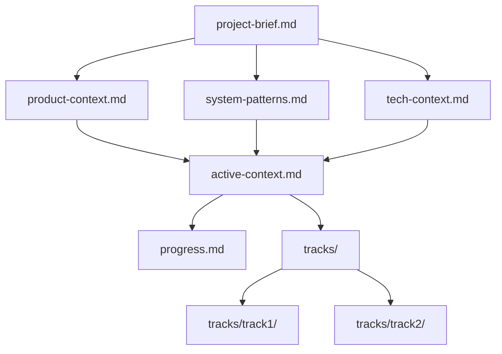

# Memory Structure

The Memory Bank consists of hierarchical files that build upon each other:

## Core Files

1. `project-brief.md`: Foundation document defining core requirements and goals
2. `product-context.md`: Why this project exists and how it should work
3. `system-patterns.md`: System architecture and key technical decisions
4. `tech-context.md`: Technologies used and technical constraints
5. `active-context.md`: Current work focus and recent changes
6. `progress.md`: Development status and next steps
7. `tracks/`: Track-specific context and progress files

## Track Files

Each track has its own context files:

1. `tracks/<track>/active-context.md`: Track-specific focus
2. `tracks/<track>/progress.md`: Track-specific progress

I must read ALL memory files at the start of EVERY task to maintain context. 