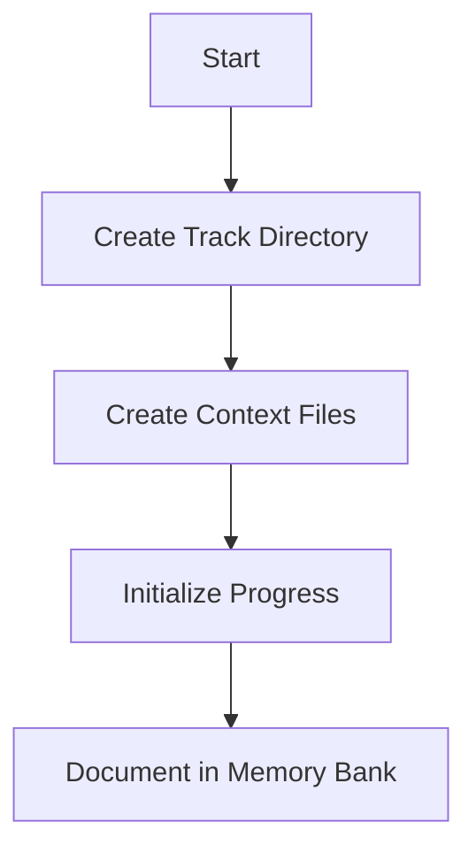
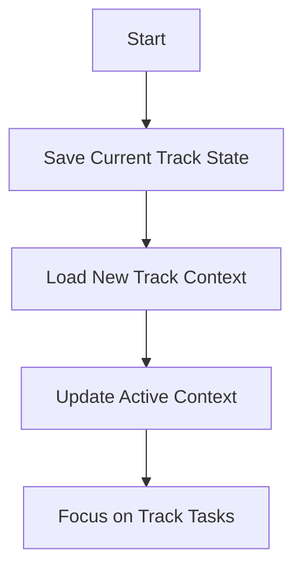

# Track Management

Tracks are conceptual workstreams representing distinct functional areas that persist over time and may span multiple branches.

## Track Initialization

When initializing a new track with **$track init <name>**:

1. Create track directory structure
2. Create initial context files
3. Initialize progress tracking
4. Document the track in the main memory bank

## Track Switching

When switching tracks with **$track <name>**:

1. Save the current track's state
2. Load the new track's context
3. Update active-context.md to reflect the track focus
4. Focus on the track's specific tasks

## Track Status

When checking track status with **$track status**:

1. Review all track progress files
2. Identify dependencies between tracks
3. Summarize the status of each track
4. Highlight any conflicts or blockers

## Branch Management

When updating a branch with **$branch update**:

1. Update the feature branch with the latest from main
2. Resolve any conflicts
3. Document the update in the track's context
4. Update the track's progress 