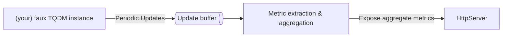

# Prometheus exporter for tqdm

Publish your pretty CLI stats for monitoring elsewhere

## Usage

There are no security or authentication mechanisms provided, be careful exposing the host more widely

### Initalise the proxy

```python
proxy = TqdmPromProxy(http_host='[::1]', http_port=3000, metric_func=metric_formatter_func)
proxy.start()
```

### Use the proxy

Replace `tqdm` initalisers with `proxy.tqdm`.

```python
for item in proxy.tqdm(range(100), desc='My first bar')
    item.doathing()

with proxy.tqdm(range(100), desc='My second bar') as f:
    f.update(50)

# etc
```

### Formatting your content

TQDM bars are a lot more verbose than prometheus metrics.
You can customise their names by passing in a function with this signature.

```python
def metric_formatter_func(metric_name: str, metric_property: str, metric_scale: str) -> str:
    pass
```

`metric_property` is one of:

- `completed` the number executions thus far in TQDM;
- `total` the configured expected maximum in TQDM as `tqdm(total=x)`;
- `active` based on the naming, how many current bars are being grouped together as this name
- `finished` based on the naming, how many bars with this name have been completely finished

The `str` that is returned must adhere to the metric naming conventions (A-Za-z0-9\_) outlined in the prometheus docs [https://prometheus.io/docs/practices/naming/](https://prometheus.io/docs/practices/naming/)

This function is called a lot, so avoid computation or cache your values

Additionally to control which properties are aggregated, provide a `bucket_func`:
This example will aggregate all bars with a description starting with upload together

```python
def bucketting_func(snapshot: TqdmSnapshot):
    if snapshot.desc.lowercase().startswith('upload'):
        return "Upload"

    return snapshot.desc
```

If you require `tqdm.write` for sticky console output,

```python
from tqdm import tqdm as tqdm_og
tqdm_og.write('Job done')
```

```sh
curl http://[::1]:3000/metrics
```

> [!WARNING]  
> For windows users ensure you add this to your `__main__` block, and before any initialisation of `TqdmPrometheusProxy`
>
> ```python
> from multiprocessing import freeze_support
> freeze_support()
> ```

## Overview


